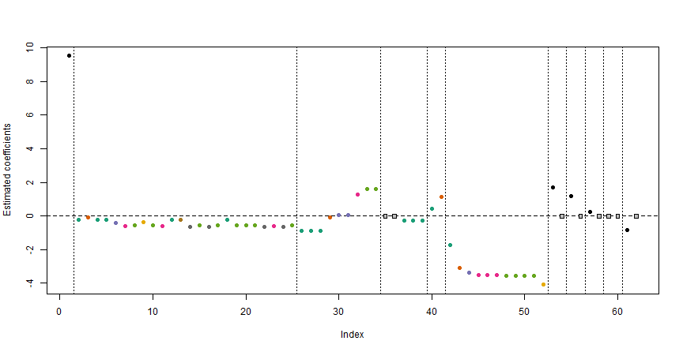

# Sparse Modelling with Categorical Predictors

Sparse Modeling refers to a modeling approach that aims to identify and utilize a small number of important features or variables in a dataset while ignoring or discarding the less important ones. 
Here, "sparse" refers to the idea of using a small number of important features or variables in a dataset, while ignoring or discarding the less important ones.
Some frequently used Sparse Modeling approaches are - Lasso Regression, Ridge Regression, and Elastic Net Regression.
All these three types also fall under the category of Penalized Regression, as well as Constrained Regression. 
They help in selecting the important variables by reducing the coefficient of not-so-important (in a relative sense) to zero. 
In the case of Lasso, the coefficient of those variables in the model becomes exactly equal to zero.
Thus, using the above approaches we basically select coefficients, rather than variables. 
If it is a metric variable, it simply means selecting that variable only. However, this becomes problematic for categorical explanatory variables. 

